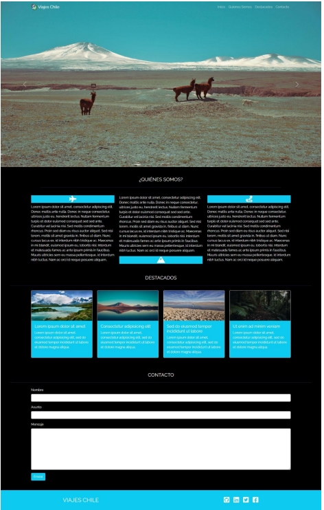

# Author: 
Eduardo Marval

# Date: 
4 April, 2023

# Title: 
Prueba - Viajes Chile

# Description:
La agencia Viajes Chile solicita la creación de su landing page, que tenga un diseño atractivo
e innovador, utilizando los conocimientos que has adquirido a través de las distintas
unidades. Para esto, puedes guiarte por la siguiente estructura:

# Tipografías:
- font-family: 'Noto Sans JP', sans-serif;

# Iconos (Font Awesome):
- fa-plane.
- fa-mountain.
- fa-route.
- fa-square-github.
- fa-linkedin.
- fa-square-twitter.
- fa-square-facebook

# Requirements:

- Una barra de navegación fija en la parte superior de la pantalla, con el logo y links a
diferentes secciones de la página, haciendo un smooth scroll.

- Un carousel que muestre las imágenes destacadas del sitio.

- Una sección de presentación, utilizando favicons y 3 párrafos (debe desaparecer en tamaños pequeños de pantalla).

- Una sección de destacados, que muestre 4 cards (tarjetas) con la imagen e información asociada.

- Una sección de formulario de contacto.

- Una sección footer con links a las redes sociales.

- Construir la estructura de la página usando HTML.

# Construir la estructura de un archivo HTML, utilizando correctamente las etiquetas semánticas para definir las distintas secciones de la página.

# Realizar correctamente la carga de archivos y organización del directorio.

- Componer visualmente el documento HTML con propiedades CSS.

- Aplicar la sintaxis de CSS utilizando selectores y clases de manera correcta,
definiendo notoriamente el aspecto visual del documento.

- Utilizar recursos externos como Google Fonts y Font Awesome, para definir
estilos de fuente.

- El código debe estar ordenado, documentado e indentado.

- Emplear elementos de Bootstrap en el documento HTML.

- Realizar una correcta integración del CDN de Bootstrap.

- Emplear al menos 3 componentes de Bootstrap (excluyendo aquellos con
JavaScript), haciendo uso de la grilla y de clases utilitarias.

- Documentar la versión de los recursos utilizados.

# bootstrap@5.0.2
# jquery-3.6.4.slim.js
# font-awesome@6.3.0

- Agregar componentes que utilicen JavaScript.

- Utilizar adecuadamente la sintaxis de JavaScript.

- Aplicar correctamente dos o más componentes de Bootstrap JS (carousel,
tooltips, entre otros).

- El código debe estar ordenado y documentado.

- Gestionar el código fuente utilizando Github.

- Inicializar GIT para versionar el proyecto localmente, realizando 5 o más
commits.

- Implementar la creación de repositorio remoto en Github para el
versionamiento del proyecto.

- Crear la página en Github Pages.

● /assets/img para las imágenes.
● /assets/js para los archivos javascript.
● /assets/css/main.css para los archivos CSS.
● /index.html.
